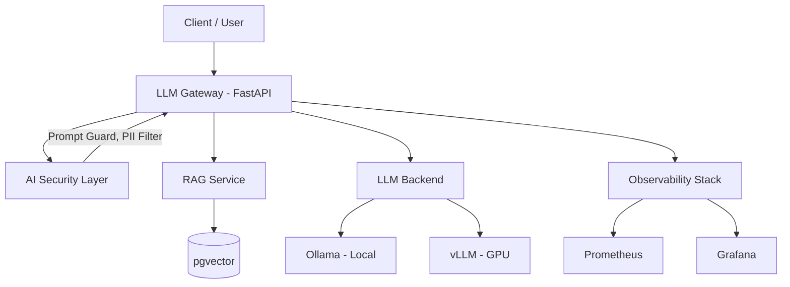

# 🧠 LLMOps Platform Lab

Production-grade MLOps/LLMOps infrastructure lab — LLM Gateway, RAG Pipeline, AI Security, and Observability.

> 🎯 **Purpose:** Demonstrate end-to-end AI infrastructure skills for DevSecOps (AI-Ready) roles.


---


## 📈 Results

| Metric | Value |
|--------|-------|
| LLM Gateway | Multi-provider routing (OpenAI, Ollama, etc.) |
| RAG Pipeline | Document ingestion + vector search + generation |
| AI Security | Prompt Guard + input/output scanning |
| Monitoring | Prometheus + Grafana dashboards for LLM metrics |
| Stack | Full Docker Compose orchestration (one command) |
| Security scanning | Blocks prompt injection + data leakage |

---
## 🏗️ Architecture

```text
┌─────────────────────────────────────────────────────────────────┐
│                        Client / User                             │
└──────────────────────────────┬──────────────────────────────────┘
                               │
                               ▼
┌──────────────────────────────────────────────────────────────────┐
│                    LLM Gateway (FastAPI)                          │
│  • API Key Auth  • Rate Limiting  • Cost Tracking  • Routing     │
└──────────┬───────────────────┬───────────────────┬───────────────┘
           │                   │                   │
           ▼                   ▼                   ▼
┌──────────────────┐ ┌─────────────────┐ ┌─────────────────────────┐
│  AI Security     │ │  RAG Service    │ │  LLM Backend            │
│  • Prompt Guard  │ │  • Embeddings   │ │  • Ollama (local)       │
│  • Input Valid.  │ │  • pgvector     │ │  • vLLM (GPU)           │
│  • PII Filter    │ │  • Retrieval    │ │  • OpenAI-compatible    │
└──────────────────┘ └─────────────────┘ └─────────────────────────┘
           │                   │                   │
           └───────────────────┼───────────────────┘
                               ▼
┌──────────────────────────────────────────────────────────────────┐
│                    Observability Stack                            │
│  • Prometheus (metrics)  • Grafana (dashboards)  • Loki (logs)   │
│  • Token cost tracking   • Latency P95/P99       • Error rates   │
└──────────────────────────────────────────────────────────────────┘
```





---

## 📁 Project Structure

```text
llmops-platform-lab/
├── docker-compose.yml          # Full stack orchestration
├── gateway/                    # LLM Gateway service
│   ├── main.py                 # FastAPI app (routing, auth, rate limit)
│   ├── security.py             # AI Security layer
│   ├── requirements.txt
│   └── Dockerfile
├── rag/                        # RAG service
│   ├── main.py                 # FastAPI app (embed, retrieve, generate)
│   ├── requirements.txt
│   └── Dockerfile
├── monitoring/
│   ├── prometheus.yml          # Prometheus config
│   ├── grafana/
│   │   └── dashboards/         # Pre-built dashboards
│   └── alerts.yml              # Alert rules
├── docs/
│   ├── AI_SECURITY_CHECKLIST.md
│   └── MLOPS_PIPELINE_SPEC.md
├── .github/workflows/
│   └── ci.yml                  # CI pipeline
├── .env.example                # Config template
└── README.md
```

---

## 🚀 Quick Start

```bash
# 1. Clone
git clone https://github.com/DerbSwag/llmops-platform-lab.git
cd llmops-platform-lab

# 2. Configure
cp .env.example .env

# 3. Start all services
docker compose up -d

# 4. Access
# - LLM Gateway:  http://localhost:8000/docs
# - RAG Service:  http://localhost:8001/docs
# - Grafana:      http://localhost:3000 (admin/admin)
# - Prometheus:   http://localhost:9090
```

---

## 🔧 Components

| Service | Port | Purpose |
|---------|------|---------|
| LLM Gateway | 8000 | API routing, auth, rate limiting, cost tracking |
| RAG Service | 8001 | Document ingestion, embedding, retrieval |
| Ollama | 11434 | Local LLM inference |
| PostgreSQL + pgvector | 5432 | Vector storage for RAG |
| Prometheus | 9090 | Metrics collection |
| Grafana | 3000 | Dashboards & alerting |

---

## 🔒 AI Security Features

- ✅ Prompt injection detection (pattern + classifier)
- ✅ Input validation (length, encoding, format)
- ✅ PII filtering before sending to LLM
- ✅ API key management (hashed, rotatable)
- ✅ Rate limiting per key (token bucket)
- ✅ Response sanitization
- ✅ Audit logging

See [docs/AI_SECURITY_CHECKLIST.md](docs/AI_SECURITY_CHECKLIST.md) for full checklist.

---

## 📊 Monitoring & Cost Control

- Token usage per API key (input/output tokens)
- Cost estimation per request (configurable $/token)
- Latency percentiles (P50, P95, P99)
- Error rates by type
- Cache hit ratio
- Alert on budget threshold

---

## 📄 Documentation

- [AI Security Checklist](docs/AI_SECURITY_CHECKLIST.md) — Infrastructure-level AI security controls
- [MLOps Pipeline Spec](docs/MLOPS_PIPELINE_SPEC.md) — Pipeline design, deployment strategy, rollback

---

## 🛠️ Tech Stack

| Layer | Technology |
|-------|-----------|
| Language | Python 3.11+ |
| API Framework | FastAPI |
| LLM Runtime | Ollama / vLLM |
| Vector DB | PostgreSQL + pgvector |
| Embeddings | sentence-transformers |
| Orchestration | Docker Compose |
| Monitoring | Prometheus + Grafana |
| CI/CD | GitHub Actions |
| Security | Custom middleware + OWASP LLM Top 10 |

---

## 📄 License

MIT
